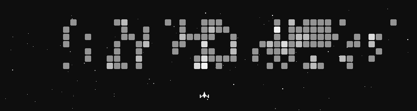

 

 

 

> **Hi, I'm Kramik!** — I build end-to-end: React frontends, FastAPI backends, ESP32 firmware, and 3D-printed hardware.
> Award-winning robotics builder. Currently shipping a smart IoT shoe care machine with image recognition.

 

 

 

<table>
<tr>
<th>Project</th>
<th>Focus</th>
<th>Stack</th>
</tr>
<tr>
<td width="25%"><strong><a href="https://github.com/kramikkk/smart-shoe-care-machine">Smart Shoe Care Machine</a></strong></td>
<td>IoT shoe cleaning, sterilization, and drying system with image recognition.</td>
<td>TypeScript, FastAPI, ESP32, AI</td>
</tr>
<tr>
<td><strong><a href="https://github.com/kramikkk/conan-ai-cam">Conan AI Cam</a></strong></td>
<td>ESP32-CAM TinyML vision system for real-time object detection with TFT display.</td>
<td>C, TinyML, Embedded Vision</td>
</tr>
<tr>
<td><strong><a href="https://github.com/kramikkk/slt-app">SLT App</a></strong></td>
<td>Mobile sign language translator with sign-to-text and text-to-sign workflows.</td>
<td>Kotlin, Android, ML</td>
</tr>
<tr>
<td><strong><a href="https://github.com/kramikkk/vitalink-ai">Vitalink AI</a></strong></td>
<td>IoT health and activity dashboard for student monitoring.</td>
<td>C, IoT, Dashboard</td>
</tr>
</table>

 

 

 

<table>
<tr>
<th>Area</th>
<th>Technologies</th>
</tr>
<tr>
<td><strong>Web & Backend</strong></td>
<td>Next.js, React, TypeScript, Tailwind CSS, FastAPI, Prisma, PostgreSQL</td>
</tr>
<tr>
<td><strong>Embedded & AI</strong></td>
<td>ESP32, Arduino, Python, TensorFlow, OpenCV, TinyML</td>
</tr>
<tr>
<td><strong>Mobile & Tools</strong></td>
<td>Kotlin, Android, Git, GitHub Actions, Vercel, Blender</td>
</tr>
</table>

 

 

 

 

<table>
<tr>
<td align="center">🥇</td>
<td><strong>Special Award: Master of Sensors</strong> — StackWars 2025</td>
</tr>
<tr>
<td align="center">🥉</td>
<td><strong>3rd Place</strong> — CHEin Reaction Robotics Category 2022</td>
</tr>
<tr>
<td align="center">🥈</td>
<td><strong>2nd Place</strong> — LIKHA Robotics, Division Science & Technology Fair 2022</td>
</tr>
</table>

 

 

  

 

 

 

 

 

 

 

 

 

&nbsp;

&nbsp;
[-%23000000.svg?style=for-the-badge&logo=x&logoColor=ffffff&labelColor=000000&color=000000)](https://x.com/kramik_x)
&nbsp;

 

 

